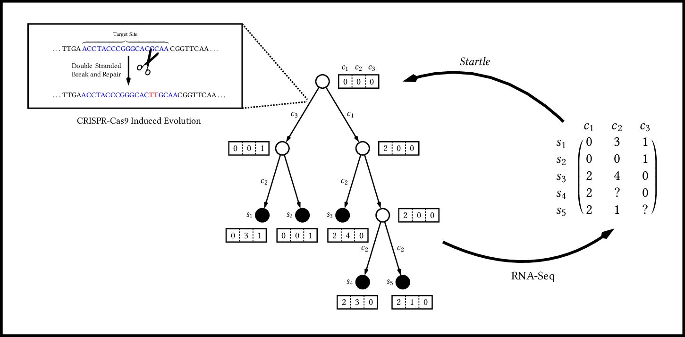

# Startle

*Startle* is a set of methods for lineage tree reconstruction that attempts 
to infer the most parsimonious tree under the *star homoplasy* evolutionary 
model. 



If you found the tool useful in your research, please cite us at:

```
@article{sashittal2022startle,
  title={Startle: a star homoplasy approach for CRISPR-Cas9 lineage tracing},
  author={Sashittal, Palash and Schmidt, Henri and Chan, Michelle M and Raphael, Benjamin J},
  journal={bioRxiv},
  pages={2022--12},
  year={2022},
  publisher={Cold Spring Harbor Laboratory}
}
```

## startle-ILP

startle-ILP is a command-line tool for inferring lineage trees from 
cell-by-state matrices. It takes as input a character-matrix and
a set of estimated mutation probabilities for each character-state pair
and outputs a inferred tree in Newick format.

### Installation

To install startle-ILP you will need the following set of libraries
and programming languages available on your device.

Requirements:
- [LEMON](https://lemon.cs.elte.hu/trac/lemon) Graph Library
- IBM ILOG [CPLEX](https://www.ibm.com/analytics/cplex-optimizer) Optimizer
- C++11 Compatible Compiler
- [perl](https://www.perl.org/) v5.10 or higher
- [python3](https://www.python.org/downloads/)

After ensuring the aforementioned libraries are properly installed,
run the following command to build the `startle` integer linear programming
solver - the output file will be named `startle` and will be located under 
the `build/` directory. You will need to ensure that
the library and include paths (specified by the `-D` flags) are properly set 
for your own system.

```
$ mkdir build; cd build
$ cmake -DLIBLEMON_ROOT=/n/fs/ragr-data/users/palash/libraries/lemon\
        -DCPLEX_INC_DIR=/n/fs/ragr-code/general/ILOG/CPLEX_Studio128/cplex/include\
        -DCPLEX_LIB_DIR=/n/fs/ragr-code/general/ILOG/CPLEX_Studio128/cplex/lib/x86-64_linux/static_pic\
        -DCONCERT_INC_DIR=/n/fs/ragr-code/general/ILOG/CPLEX_Studio128/concert/include\
        -DCONCERT_LIB_DIR=/n/fs/ragr-code/general/ILOG/CPLEX_Studio128/concert/lib/x86-64_linux/static_pic\
        ..
$ make
```

To install the required Python dependencies, we recommend
you create a new conda environment for this project. 

```
$ conda create -n startle
$ conda install python=3.8
$ conda install -c conda-forge biopython
$ conda install -c conda-forge funcy loguru tqdm networkx pandas numpy seaborn
```

### Running

After ensuring the `startle` executable is located in the `build/` directory and
that the required python dependencies are installed, you are ready to run the
`startle-ILP`. The input to this tool is a character matrix in CSV format and
a set of estimated mutation probabilities in CSV format. There are several
command line options to control the number of threads, the time limit, and
the optimality gap of the ILP.

```
$ perl scripts/startle-ilp.pl --help
usage: Infer lineage trees using Startle-ILP solver. --output|-o
--mutation-priors|-m --character-matrix|-c [--help|-h] [--mip-gap] [--threads]
[--time-limit]

required named arguments:
  --output, -o OUTPUT                          Output directory name.
  --mutation-priors, -m MUTATION-PRIORS        Input mutation prior probabilities as CSV.
  --character-matrix, -c CHARACTER-MATRIX      Input character matrix as CSV.

optional named arguments:
  --help, -h                 ? show this help message and exit
  --mip-gap MIP-GAP          ? Optimality gap for ILP solver.
                                 Default: 0.05
  --threads THREADS          ? Number of threads for ILP solver.
                                 Default: 8
  --time-limit TIME-LIMIT    ? Time limit for ILP solver.
                                 Default: 7200
```

For reference, an example character matrix and mutation prior file generated via
simulation are included in the repository. As a sanity check, ensure that this example
runs. The example lineage tree was built for 100 cells and 30 characters with dropout set
to `20%`. The ground truth tree is also included for comparison across methods.

```
$ perl scripts/startle_ilp.pl -c examples/n100_m30_d0.2_s0_p0.2_character_matrix.csv\
                              -m examples/n100_m30_d0.2_s0_p0.2_mutation_prior.csv\
                              -o example_output
```

## startle-nni

`startle-nni` is a Python command-line tool for inferring lineage trees from a cell-by-state 
matrix. The only requirement for `startle-nni` is a recent
version of Python and several packages, described below.

Requirements:
- [python3](https://www.python.org/downloads/)
- [numpy](https://numpy.org/) 
- [pandas](https://pandas.pydata.org/)
- [biopython](https://biopython.org/wiki/Documentation)
- [seaborn](https://seaborn.pydata.org/index.html)
- [funcy](https://funcy.readthedocs.io/en/stable/)
- [loguru](https://github.com/Delgan/loguru)

To run `startle-nni`, simply run `python src/nni/startle.py` from the root project
directory.

```
$ python src/nni/startle.py --help
usage: startle.py [-h] [-e E] [-m M] [--iterations ITERATIONS] [--mode {collapse,score,infer}] --output OUTPUT seed_tree character_matrix

positional arguments:
  seed_tree             Seed tree in Newick format.
  character_matrix      Character matrix.

options:
  -h, --help            show this help message and exit
  -e E                  Mutation prior pickle file.
  -m M                  Mutation prior CSV table.
  --iterations ITERATIONS
                        Number of iterations to run stochastic hill climbing before giving up.
  --mode {collapse,score,infer}
                        Different modes have different functionality.
  --output OUTPUT       Output file for newick tree.
```

The script requires several files, namely a `character_matrix` as a CSV, a `mutation_prior`
file as either CSV or Pickle file, and a `seed_tree` as Newick file. An example character matrix and mutation prior file
can be found in `examples` under the names `examples/n100_m30_d0.2_s0_p0.2_character_matrix.csv` and
`examples/n100_m30_d0.2_s0_p0.2_mutation_prior.csv`. A seed tree is the seed to start the stochastic search in `startle-nni`.
It can be obtained from any algorithm, but for convenience, we have attached a script `script/nj.py` that generates
a seed tree using neighbor joining from a `character_matrix`.

As an example, we can run `startle-nni` by first generating a seed tree
and then running `src/nni/startle.py`.

```
$ python scripts/nj.py examples/n100_m30_d0.2_s0_p0.2_character_matrix.csv --output examples/n100_m30_d0.2_s0_p0.2_seed_tree.newick
$ python src/nni/startle.py -m examples/n100_m30_d0.2_s0_p0.2_mutation_prior.csv \
  examples/n100_m30_d0.2_s0_p0.2_seed_tree.newick examples/n100_m30_d0.2_s0_p0.2_character_matrix.csv \
  --output examples/n100_m30_d0.2_s0_p0.2_startle_nni_tree.newick
```
